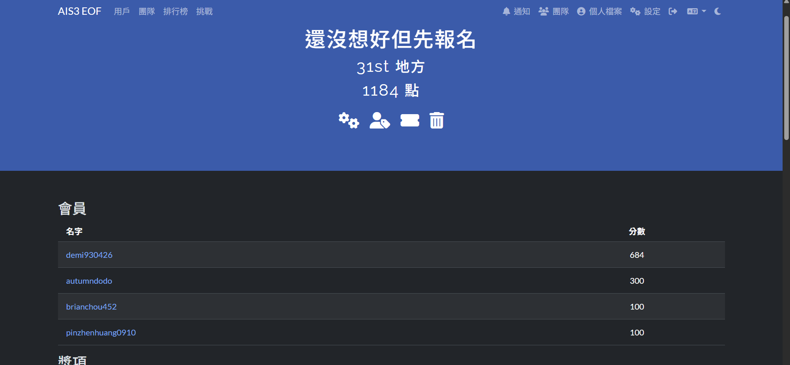
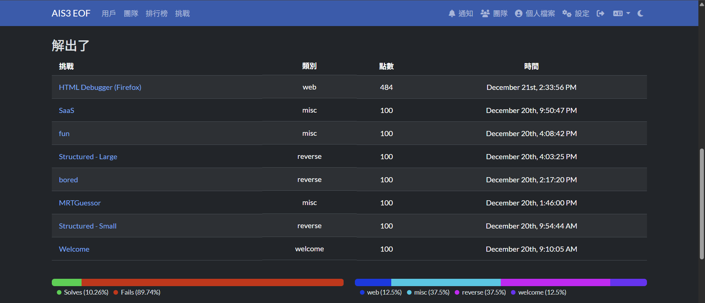
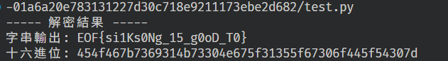

import ChallengeCard from "../../components/misc/ChallengeCard.astro";
import DjangoImg from "../../assets/images/blog/AIS3EOF2026/Django.png";
import FunImg from "../../assets/images/blog/AIS3EOF2026/fun_solved.png";

<ChallengeCard
  event="AIS3 EOF 2026 初賽"
  rank={31}
  challenges={[{ name: "fun", category: "Misc" }]}
/>

# AIS3 EOF 2026

排名 31

感謝電神隊友們 🙏





三天一直在坐牢，有摸過其他題目，像是`SaaS`、`CookieMonster Viewer`、`Welcome To The Django`、`Impure`還有前兩題 Crypto，但最後都沒有解出來  
尤其是 `Welcome To The Django` 那題，最後才去看，把 secret key 撈出來之後，不知道要用在哪裡 💀


之後再去看看大佬們的 writeup

---

## Misc

### fun

這題提供了一個 eBPF 程式 `xdp_prog.o`，可以使用 llvm-objdump 反組譯：

```sh
llvm-objdump -S xdp_prog.o
```

可以看到程式中對封包的處理：

```sh
xdp_prog.o:     file format elf64-bpf

Disassembly of section xdp:

0000000000000000 <xdp_encoder>:
       0:       b7 00 00 00 02 00 00 00 r0 = 0x2
       1:       61 13 04 00 00 00 00 00 r3 = *(u32 *)(r1 + 0x4)
       2:       61 12 00 00 00 00 00 00 r2 = *(u32 *)(r1 + 0x0)
       3:       bf 24 00 00 00 00 00 00 r4 = r2
       4:       07 04 00 00 0e 00 00 00 r4 += 0xe
       5:       2d 34 e8 01 00 00 00 00 if r4 > r3 goto +0x1e8 <LBB0_72>
       6:       71 24 0d 00 00 00 00 00 r4 = *(u8 *)(r2 + 0xd)
       7:       67 04 00 00 08 00 00 00 r4 <<= 0x8
       8:       71 25 0c 00 00 00 00 00 r5 = *(u8 *)(r2 + 0xc)
       9:       4f 54 00 00 00 00 00 00 r4 |= r5
      10:       55 04 e3 01 08 00 00 00 if r4 != 0x8 goto +0x1e3 <LBB0_72>
      11:       bf 24 00 00 00 00 00 00 r4 = r2
      12:       07 04 00 00 22 00 00 00 r4 += 0x22
      13:       2d 34 e0 01 00 00 00 00 if r4 > r3 goto +0x1e0 <LBB0_72>
      14:       71 24 17 00 00 00 00 00 r4 = *(u8 *)(r2 + 0x17)
      15:       55 04 de 01 11 00 00 00 if r4 != 0x11 goto +0x1de <LBB0_72>
      16:       bf 24 00 00 00 00 00 00 r4 = r2
      17:       07 04 00 00 2a 00 00 00 r4 += 0x2a
      18:       2d 34 db 01 00 00 00 00 if r4 > r3 goto +0x1db <LBB0_72>
      19:       69 24 24 00 00 00 00 00 r4 = *(u16 *)(r2 + 0x24)
      20:       55 04 d9 01 23 28 00 00 if r4 != 0x2823 goto +0x1d9 <LBB0_72>
      21:       b7 04 00 00 00 00 00 00 r4 = 0x0
      22:       63 4a f8 ff 00 00 00 00 *(u32 *)(r10 - 0x8) = r4
      23:       7b 4a f0 ff 00 00 00 00 *(u64 *)(r10 - 0x10) = r4
      24:       7b 4a e8 ff 00 00 00 00 *(u64 *)(r10 - 0x18) = r4
      25:       7b 4a e0 ff 00 00 00 00 *(u64 *)(r10 - 0x20) = r4
      26:       7b 4a d8 ff 00 00 00 00 *(u64 *)(r10 - 0x28) = r4
      27:       7b 4a d0 ff 00 00 00 00 *(u64 *)(r10 - 0x30) = r4
      28:       7b 4a c8 ff 00 00 00 00 *(u64 *)(r10 - 0x38) = r4
      29:       7b 4a c0 ff 00 00 00 00 *(u64 *)(r10 - 0x40) = r4
      30:       7b 4a b8 ff 00 00 00 00 *(u64 *)(r10 - 0x48) = r4
      31:       bf 25 00 00 00 00 00 00 r5 = r2
      32:       07 05 00 00 2b 00 00 00 r5 += 0x2b
      33:       2d 35 c2 01 00 00 00 00 if r5 > r3 goto +0x1c2 <LBB0_71>
      34:       71 24 2a 00 00 00 00 00 r4 = *(u8 *)(r2 + 0x2a) # 從 r2 的位址加上 0x2a 取一個 byte
      35:       a7 04 00 00 af 00 00 00 r4 ^= 0xaf
      36:       73 4a bc ff 00 00 00 00 *(u8 *)(r10 - 0x44) = r4
      37:       b7 04 00 00 01 00 00 00 r4 = 0x1
      38:       bf 25 00 00 00 00 00 00 r5 = r2
      39:       07 05 00 00 2c 00 00 00 r5 += 0x2c
      40:       2d 35 bb 01 00 00 00 00 if r5 > r3 goto +0x1bb <LBB0_71>
      41:       71 24 2b 00 00 00 00 00 r4 = *(u8 *)(r2 + 0x2b)
      42:       a7 04 00 00 f4 00 00 00 r4 ^= 0xf4
      43:       73 4a bd ff 00 00 00 00 *(u8 *)(r10 - 0x43) = r4
      44:       b7 04 00 00 02 00 00 00 r4 = 0x2
      45:       bf 25 00 00 00 00 00 00 r5 = r2
      46:       07 05 00 00 2d 00 00 00 r5 += 0x2d
      47:       2d 35 b4 01 00 00 00 00 if r5 > r3 goto +0x1b4 <LBB0_71>
      48:       71 24 2c 00 00 00 00 00 r4 = *(u8 *)(r2 + 0x2c)
      49:       a7 04 00 00 84 00 00 00 r4 ^= 0x84
      50:       73 4a be ff 00 00 00 00 *(u8 *)(r10 - 0x42) = r4
      51:       b7 04 00 00 03 00 00 00 r4 = 0x3
      52:       bf 25 00 00 00 00 00 00 r5 = r2
      53:       07 05 00 00 2e 00 00 00 r5 += 0x2e
      54:       2d 35 ad 01 00 00 00 00 if r5 > r3 goto +0x1ad <LBB0_71>
      55:       71 24 2d 00 00 00 00 00 r4 = *(u8 *)(r2 + 0x2d)
      56:       a7 04 00 00 2d 00 00 00 r4 ^= 0x2d
      57:       73 4a bf ff 00 00 00 00 *(u8 *)(r10 - 0x41) = r4
      58:       b7 04 00 00 04 00 00 00 r4 = 0x4
      59:       bf 25 00 00 00 00 00 00 r5 = r2
      60:       07 05 00 00 2f 00 00 00 r5 += 0x2f
      61:       2d 35 a6 01 00 00 00 00 if r5 > r3 goto +0x1a6 <LBB0_71>
      62:       71 24 2e 00 00 00 00 00 r4 = *(u8 *)(r2 + 0x2e)
      63:       a7 04 00 00 04 00 00 00 r4 ^= 0x4
      64:       73 4a c0 ff 00 00 00 00 *(u8 *)(r10 - 0x40) = r4
      65:       b7 04 00 00 05 00 00 00 r4 = 0x5
      66:       bf 25 00 00 00 00 00 00 r5 = r2
      ......
```

從反組譯可以看出，flag 是從封包的特定 offset 讀出來後，逐個 byte XOR 一個固定值。

根據反組譯，可以整理出 XOR key 表，對應封包 offset 從 `0x2a` 開始，每個 byte 對應一個 XOR key。

```python
xor_table = [
    0xaf, 0xf4, 0x84, 0x2d, 0x04, 0x9a, 0x39, 0x0f,
    0x2b, 0xc0, 0x1d, 0x78, 0xd9, 0xb7, 0x0a, 0x7d,
    0xba, 0x11, 0xaa, 0xe6
]

def xdp_decode(packet_bytes):
    decoded = bytearray()
    for i, key in enumerate(xor_table):
        offset = 0x2a + i
        if offset >= len(packet_bytes):
            break
        decoded_byte = packet_bytes[offset] ^ key
        decoded.append(decoded_byte)
    return decoded

with open("flag.enc", "rb") as f:
    enc_bytes = f.read()

decoded_flag = xdp_decode(enc_bytes)
print(decoded_flag.decode(errors="ignore"))
```



得到 flag

```txt
EOF{si1Ks0Ng_15_g0oD_T0}
```


---

就是說，這一科期末考大失敗啊 😭  
在期末考周參加 EOF 初賽還是太極限了，那三天都在打 CTF 或去上 AIS3 的課，導致後面一個禮拜每天都在創造奇蹟，瘋狂趕報告或是讀期末考，天天熬夜甚至是通宵。  
明年再加油吧 (╥﹏╥)
