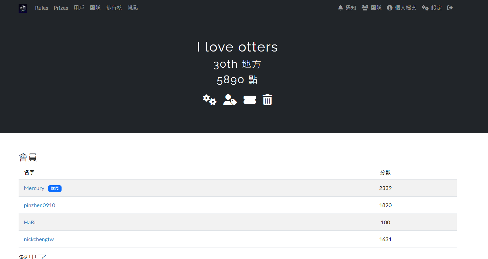
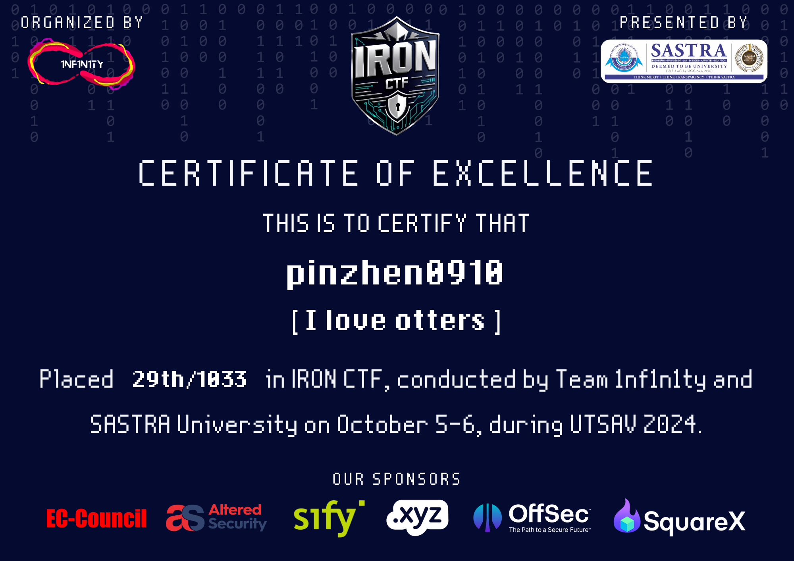
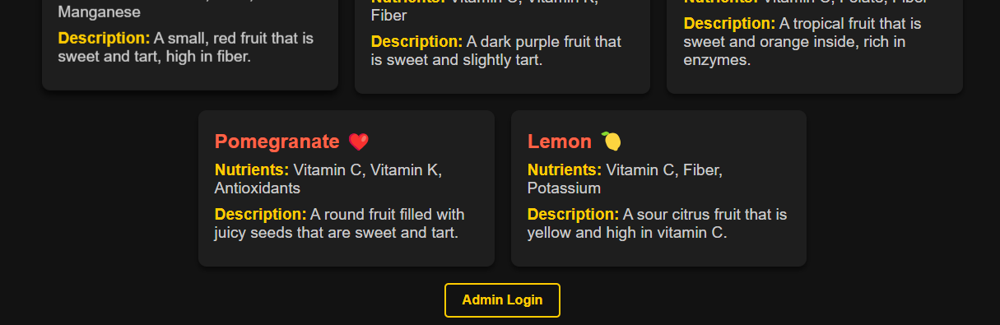
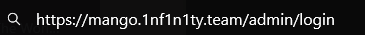
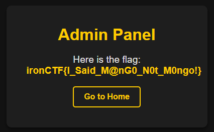

import ChallengeCard from "../../components/misc/ChallengeCard.astro";

<ChallengeCard
	event="IRON CTF 2024"
	rank={29}
	total={1033}
	challenges={[{ name: "Mango", category: "Web" }]}
/>

之前沒有留 writeup 的習慣，或是太水的題目不知道怎麼寫就沒有留了 (╥﹏╥)



之前截圖的時候是 30 名，但是好像有隊伍被取消成績，就變成 29 / 1033



還贏了一個 .xyz 域名，雖然最後沒有用 www

紀錄一下~

---

# IRON CTF 2024

## Web

### Mango

在最底下有 Admin Login



進入 admin login 頁面後發現 url 的路徑是 `https://mango.1nf1n1ty.team/admin/login`



路徑在 /admin 下面，嘗試看看進到 /admin/index

就找到 flag 了



```txt
ironCTF{I_Said_M@nG0_N0t_M0ngo!}
```
