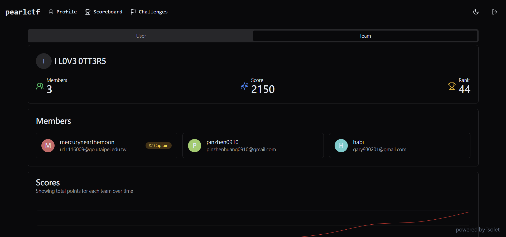
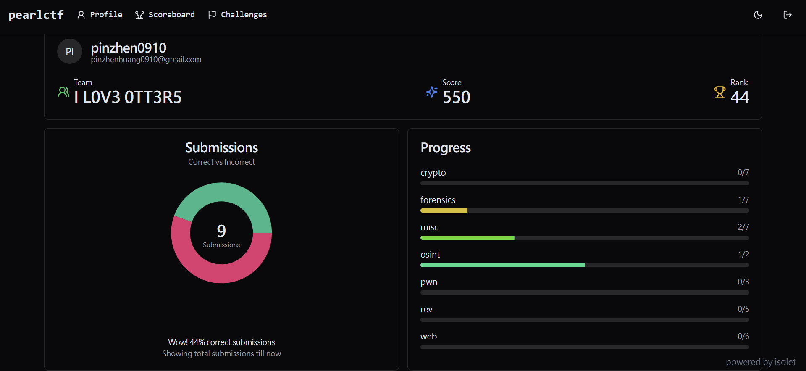
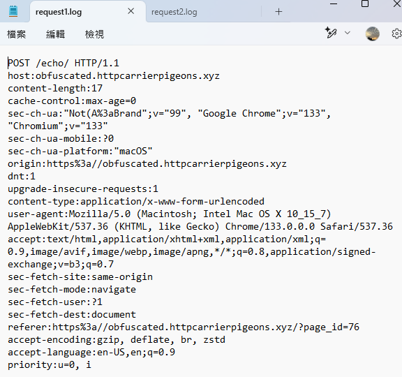
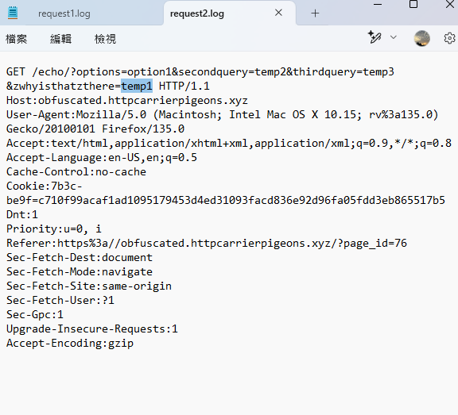
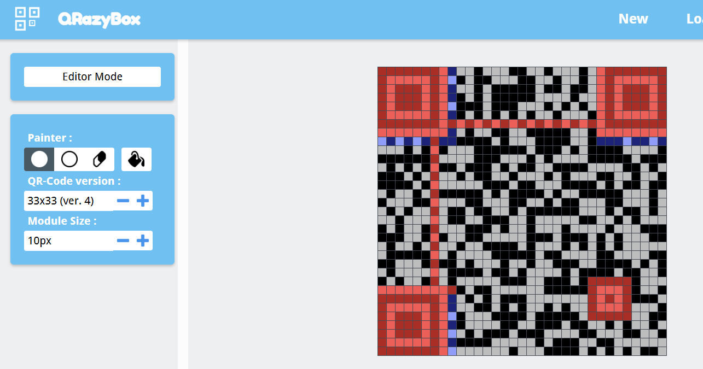
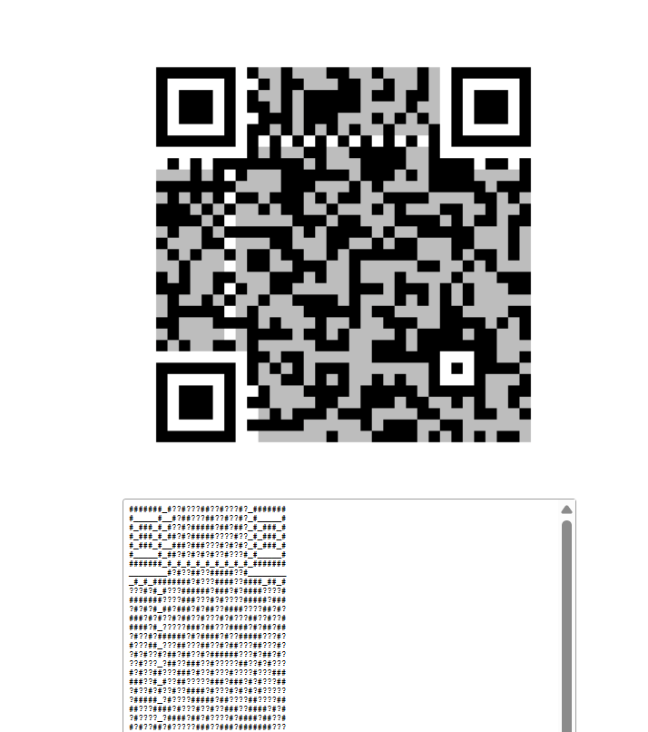
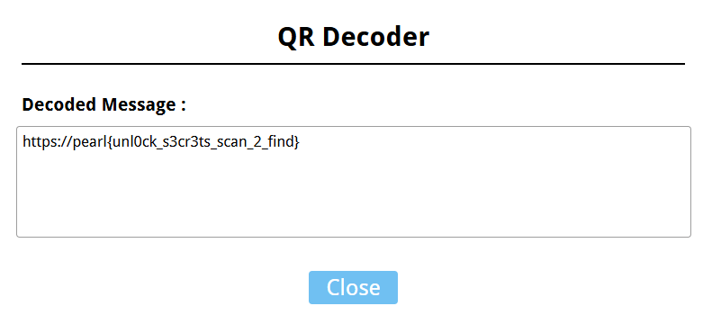

import ChallengeCard from "../../components/misc/ChallengeCard.astro";

<ChallengeCard
  event="Pearl CTF 2025"
  rank={44}
  total={1024}
  challenges={[
    { name: "HTTP Carrier Pigeons", category: "Forensics" },
    { name: "qr-secrets", category: "Misc" },
  ]}
/>

44 / 1024





CTF 這東西，越打覺得自己越菜 🥬

---

# Pearl CTF 2025

## Forensics

### HTTP Carrier Pigeons

透過題目給的網站 [連結](https://fingerprint.byu.edu)，去對照兩份 request

  


```
pearl{haproxy_evilginx}
```

## Misc

### qr-secrets

這一題用到工具 [QRazyBox](https://merri.cx/qrazybox/)

原圖把 qr code 可以辨識的地方都塗掉了，從橫向去數就會發現這是 33\*33，且邊緣可以對照出是 ver.4，然後慢慢把其他黑白區域填回去





就能得到 flag



```
pearl{unl0ck_s3cr3ts_scan_2_find}
```
