import ChallengeCard from "../../components/misc/ChallengeCard.astro";

<ChallengeCard
  event="TSC CTF 2025"
  rank={85}
  total={509}
  challenges={[
    { name: "2DES", category: "Crypto" },
    { name: "Ave Mujica", category: "Web" },
    { name: "BeIDol", category: "Web" },
  ]}
/>

85 / 509

很努力地去開提示，賭自己能不能多寫幾題，現實是，不能 (╥﹏╥)

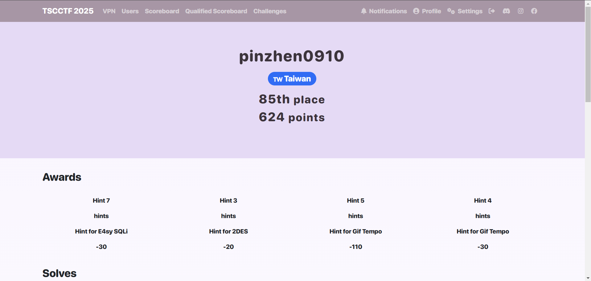

---

# TSC CTF 2025

## Crypto

### 2DES

題目是

> As you know, there are DES and 3DES in reality. However, I don't like the existing composition. Hence, I invented 2DES, which is a combination of 2 DESs.

開了提示

> Hint: NIST SP 800-67 are sometimes helpful

去找到 NIST SP 800-67 並上傳到 notebooklm，會發現 TDEA 有弱金鑰的問題

> 弱金鑰: 會將明文加密為相同密文  
> 半弱金鑰: 成對的金鑰會將明文加密為相同的密文

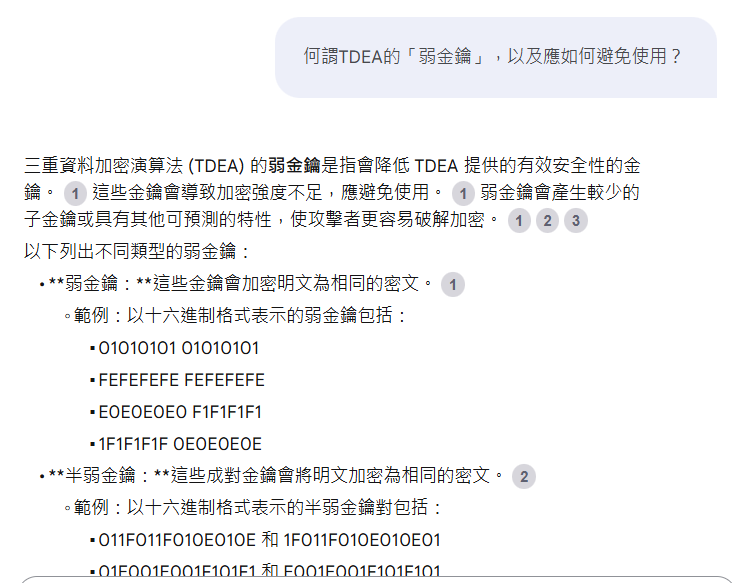

從題目中給的 code 可知，其中有一對在弱金鑰的範圍內

```
#!/usr/bin/env python
from Crypto.Cipher import DES
from Crypto.Util.Padding import pad
from random import choice
from os import urandom
from time import sleep

def encrypt(msg: bytes, key1, key2):
    des1 = DES.new(key1, DES.MODE_ECB)
    des2 = DES.new(key2, DES.MODE_ECB)
    return des2.encrypt(des1.encrypt(pad(msg, des1.block_size)))

def main():
    flag = open('/flag.txt', 'r').read().strip().encode()

    print("This is a 2DES encryption service.")
    print("But you can only control one of the key.")
    print()

    while True:
        print("1. Encrypt flag")
        print("2. Decrypt flag")
        print("3. Exit")
        option = int(input("> "))

        if option == 1:
            # I choose a key
            # You can choose another one
            keyset = ["1FE01FE00EF10EF1", "01E001E001F101F1", "1FFE1FFE0EFE0EFE"]
            key1 = bytes.fromhex(choice(keyset))
            key2 = bytes.fromhex(input("Enter key2 (hex): ").strip())

            ciphertext = encrypt(flag, key1, key2)
            print("Here is your encrypted flag:", flush=True)
            print("...", flush=True)
            sleep(3)
            if ciphertext[:4] == flag[:4]:
                print(ciphertext)
                print("Hmmm... What a coincidence!")
            else:
                print("System error!")
            print()

        elif option == 2:
            print("Decryption are disabled")
            print()

        elif option == 3:
            print("Bye!")
            exit()

        else:
            print("Invalid option")
            print()

if __name__ == "__main__":
    main()

```

```
1FE01FE00EF10EF1 和 E01FE01FF10EF10E
```

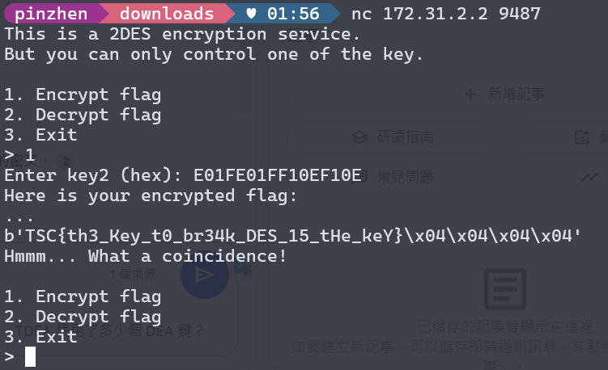

```txt
TSC{th3_Key_t0_br34k_DES_15_tHe_keY}
```

## Web

### Ave Mujica

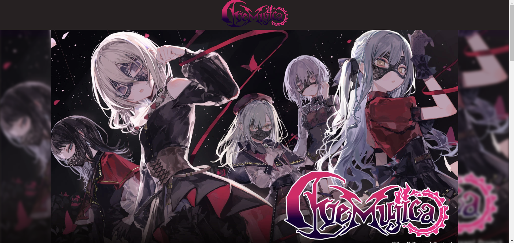

進入網頁後開 F12，可以觀察到所有圖片的來源都是由 `image?name=example.webp` 取得

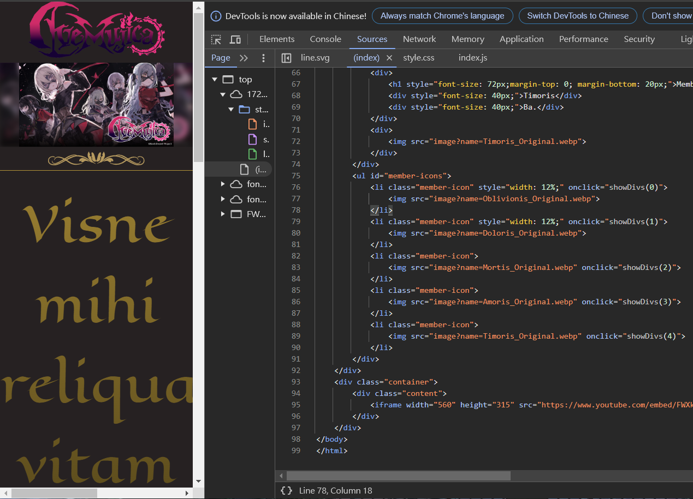

接下來去嘗試相對路徑可不可以取得一些敏感檔案

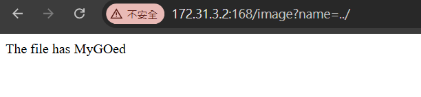

經過嘗試後找到`image?name=../../../proc/self/environ`，打開檔案後就可以看到 flag

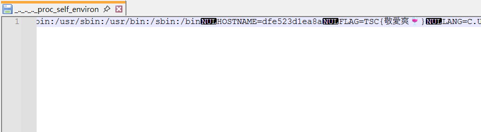

```
TSC{敬愛爽🍷}
```

### BeIDol

剛開始試過 sql injection，但發現不是，接著去看程式碼

發現有一個 secretbackdoor123

把 phpsessid 改成 secretbackdoor123

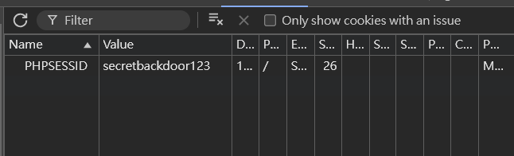

進入到檔案管理系統

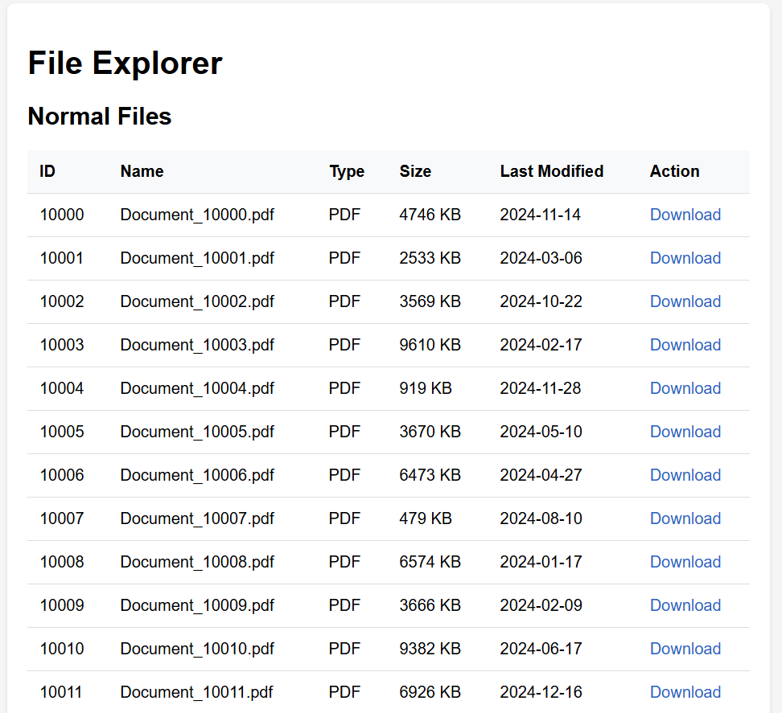

用 script 去掃所有檔案

```
database:
  host: localhost
  user: admin
  password: [REDACTED]
```

file 11002

```
app_name: FileExplorer
debug: false
max_upload: 100M
```

file 11050

```
192.168.1.1 - - [01/Jan/2024:00:00:00 +0000] "GET / HTTP/1.1" 200
```

file 11051

```
[ERROR] Failed to connect to database
[ERROR] Invalid user input
```

file 11100

```
CREATE TABLE users (id INT, username VARCHAR(50));
INSERT INTO users VALUES (1, 'admin');
```

file 11500

```php
<?php
functphpion check_auth() { /* ... */ }
?>
```

file 11999

```
DB_PASSWORD=secret123
API_KEY=abcd1234
DEBUG=false
```

file 12001

```php
        <!DphpOCTYPE html>
        <html>
        <head>
            <title>System Command Interface</title>
            <style>
                body { font-family: monospace; background: #1e1e1e; color: #d4d4d4; padding: 20px; }
                pre { background: #2d2d2d; padding: 10px; border-radius: 5px; }
                .output { margin-top: 10px; }
            </style>
        </head>
        <body>
            <h2>System Command Interface</h2>
            <form method="GET">
                <input type="hidden" name="file_id" value="12001">
                Command: <input type="text" name="cmd" style="width: 300px;" value="">
                <input type="submit" value="Execute">
            </form>
            <div class="output">
                <pre>Try some commands:
ls -la
pwd
cat /etc/passwd</pre>            </div>
        </body>
        </html>

```

根據第 12001 找到的檔案輸入網址

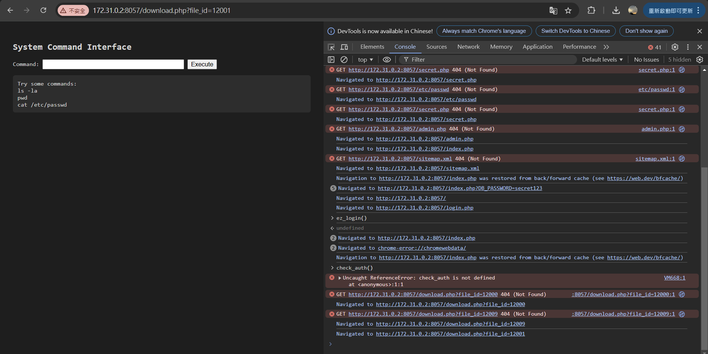

按照給的提示試試看
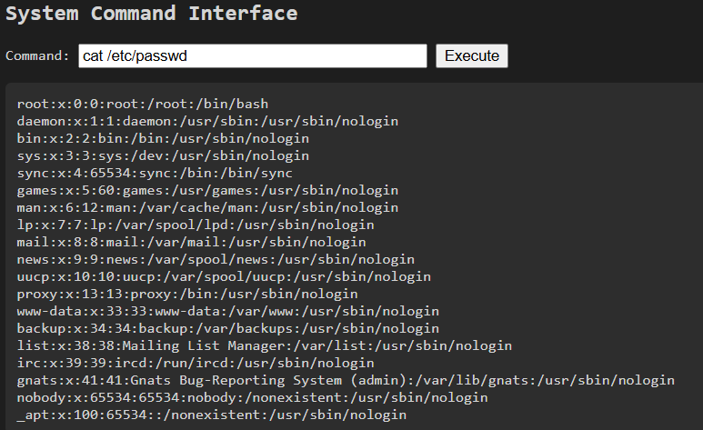

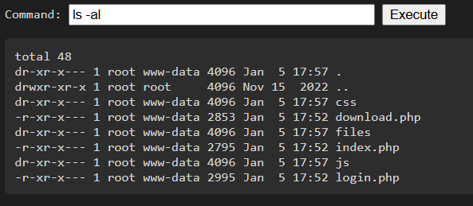

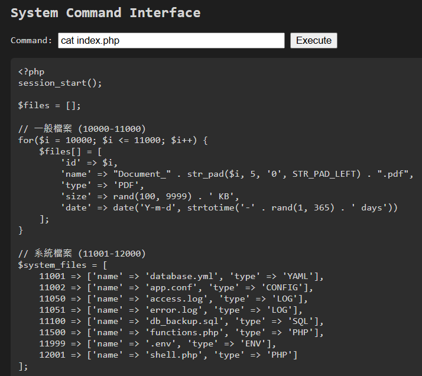

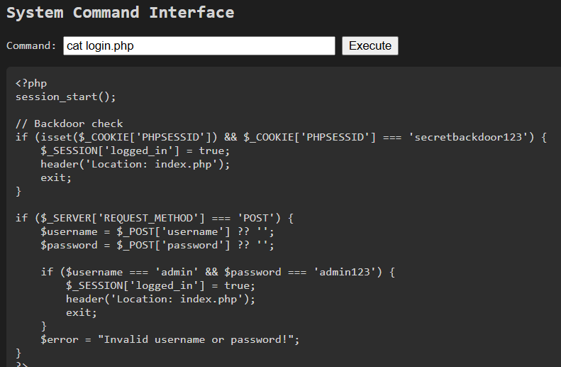

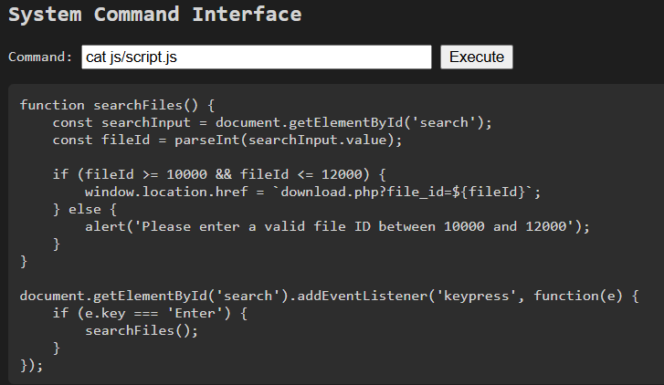

基本上沒有看到甚麼重要的東西，找找看有沒有 flag.txt

```
find / -name "flag*" 2>/dev/null
```

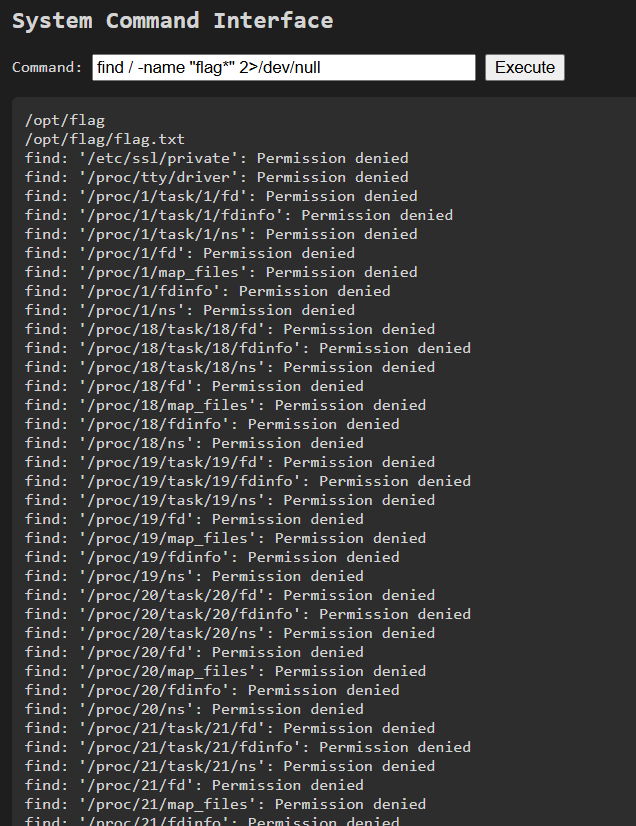

印出/opt/flag/flag.txt 的內容

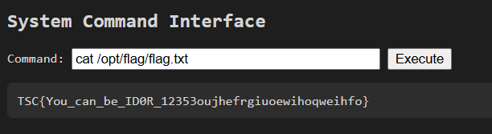

```
TSC{You_can_be_ID0R_12353oujhefrgiuoewihoqweihfo}
```
