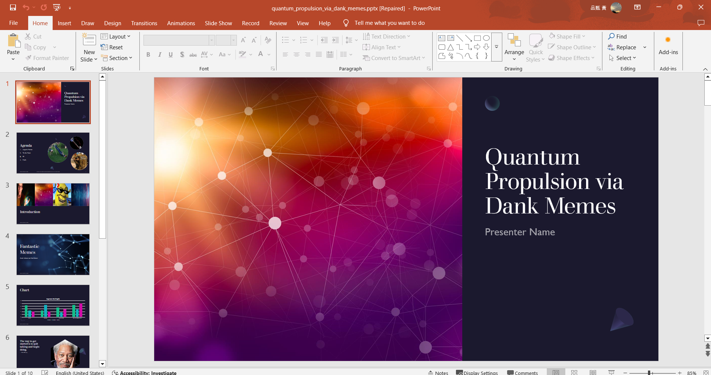
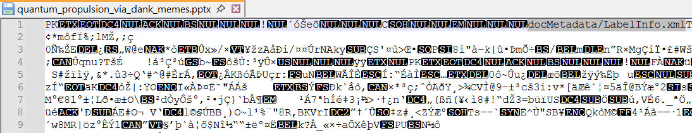
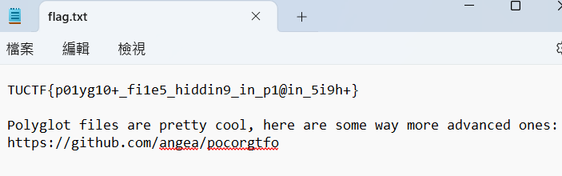
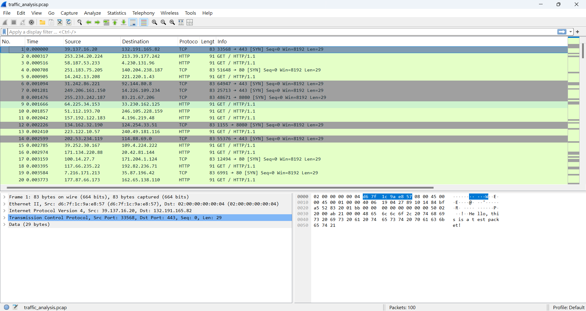
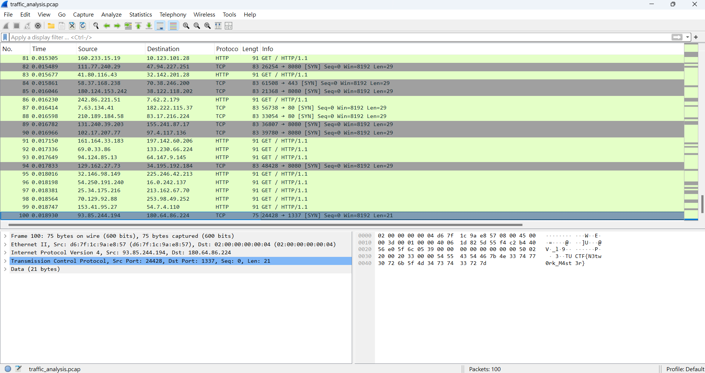

import ChallengeCard from "../../components/misc/ChallengeCard.astro";

<ChallengeCard
  event="TUCTF"
  challenges={[
    { name: "Mystery Presentation", category: "Forensics" },
    { name: "Packet Detective", category: "Forensics" },
  ]}
/>

# TUCTF

## Forensics

### Mystery Presentation

拿到一個 pptx





透過開頭的`pk`以及`docMetadata/LabelInfo.xml`判斷這個 pptx 是壓縮檔，所以對 pptx 解壓縮


解壓縮後可以看到一個`secret_data.7z`，解壓縮後得到 flag.txt



```
TUCTF{p01yg10+_fi1e5_hiddin9_in_p1@in_5i9h+}
```

### Packet Detective



flag 在最後一筆



```
TUCTF{N3tw0rk_M4st3r}
```
