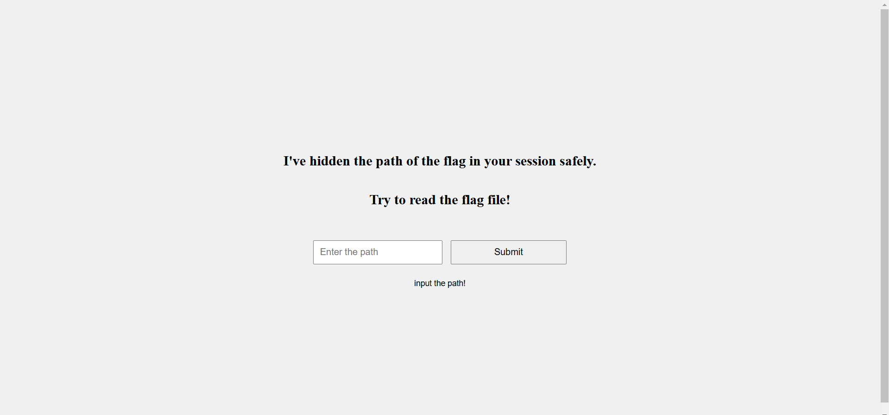
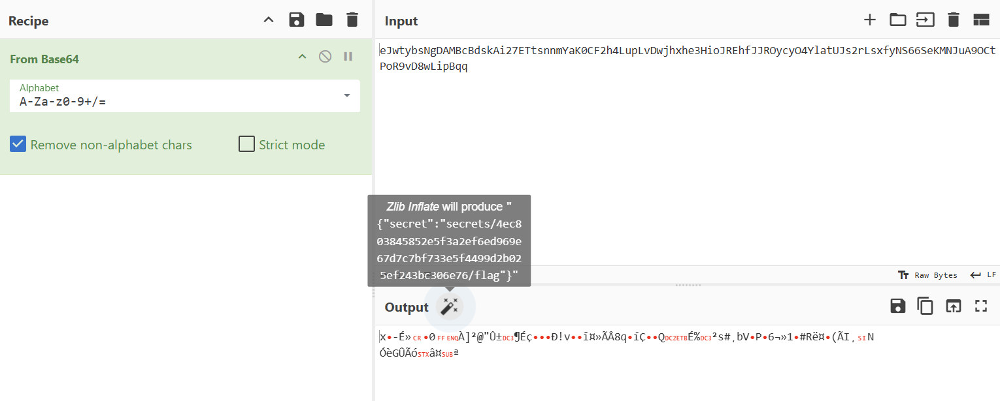
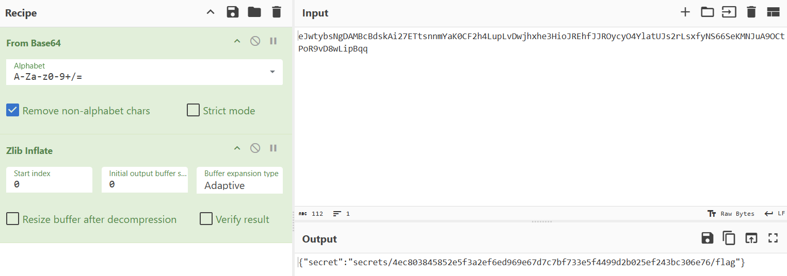
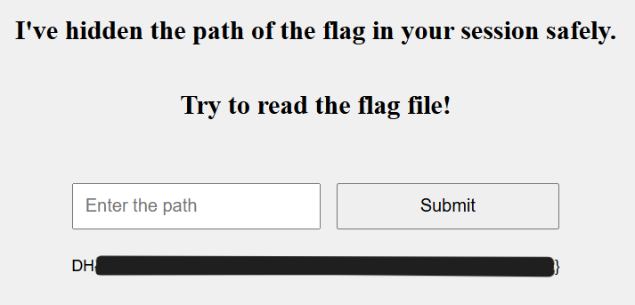

# Secure Secret

題目

> The flag file is placed hidden in a random directory, and concealed its directory inside the session.  
> Find the vulnerability and get the flag!  
> The flag format for this challenge is DH{...}.

根據提示把 cookie 裡面的 session 拿出來，去 cyberchef 試試看

找到 path 是 `secrets/4ec803845852e5f3a2ef6ed969e67d7c7bf733e5f4499d2b025ef243bc306e76/flag`  
輸入 `4ec803845852e5f3a2ef6ed969e67d7c7bf733e5f4499d2b025ef243bc306e76/flag`

