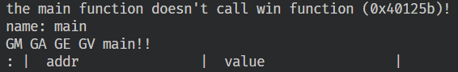
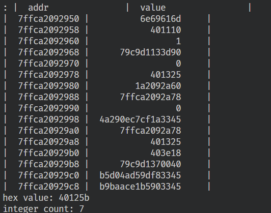
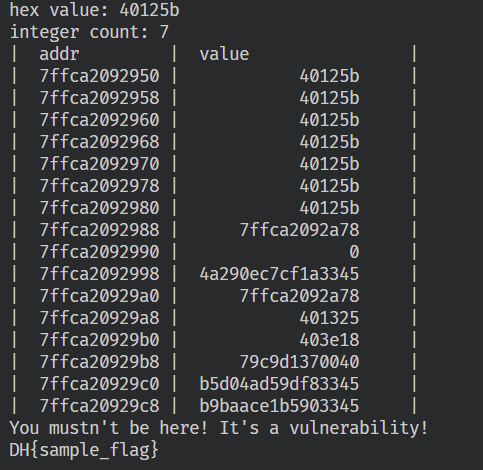
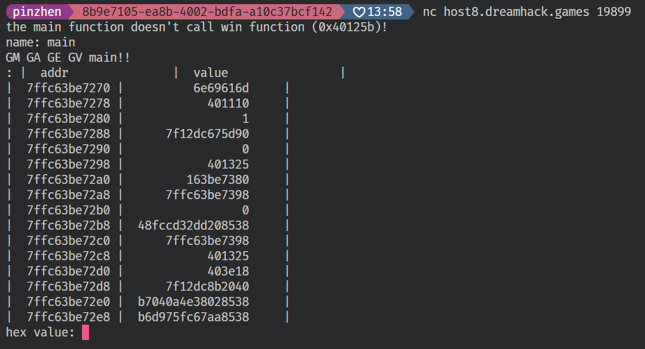
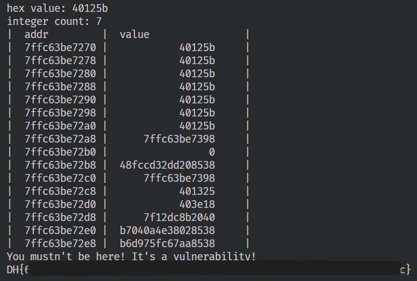

# baby-bof

[題目連結](https://dreamhack.io/wargame/challenges/974)

先 build docker image

```bash
docker build -t baby-bof .
docker run --rm -it -p 33333:33333 baby-bof
```

`nc localhost 33333` 之後會先得到 win 的 address，接下來 name 輸入 main 查看 main 附近的 address



看左邊的 address 可以知道 return address 應該在 idx=7，所以接下來先輸入 win 的 address，再輸入 7



就可以拿到 flag



接下來就正式試一次





得到 flag
