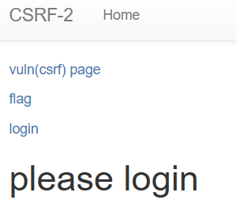
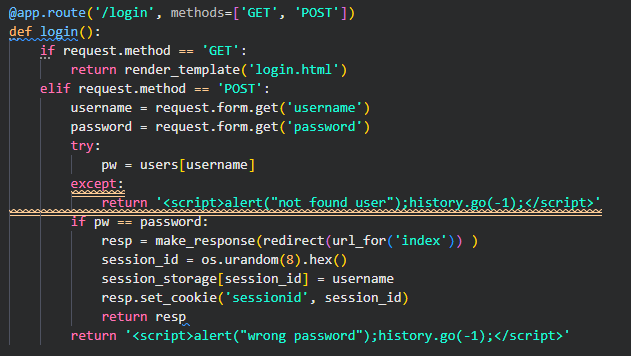
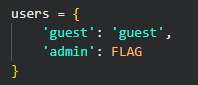
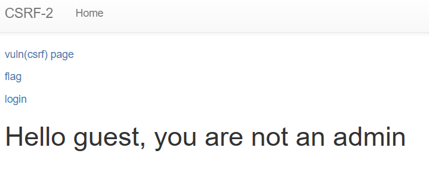
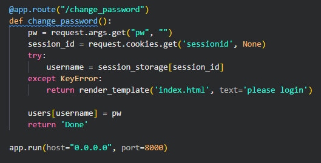
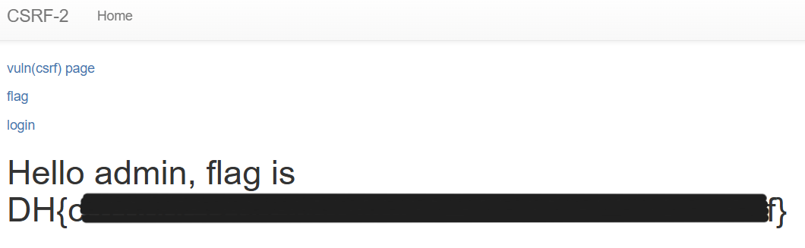

# csrf-2



題目會比對輸入的密碼是否等於 users[password]





先以 guest 登入



可以透過 `/change_password` 去改密碼



因為透過 `flag` 頁面的 session_storage[session_id] 都會是 admin，所以可以以 guest 的身分去改 admin 的密碼

試試看

```javascript

```

然後以密碼為 test 去登入 admin 帳號


