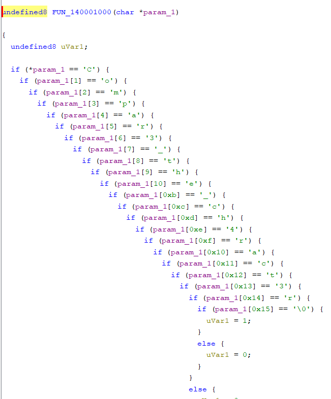

# rev-basic-1

題目

> 이 문제는 사용자에게 문자열 입력을 받아 정해진 방법으로 입력값을 검증하여 correct 또는 wrong을 출력하는 프로그램이 주어집니다.  
> 해당 바이너리를 분석하여 correct를 출력하는 입력값을 알아내세요.  
> 획득한 입력값은 DH{} 포맷에 넣어서 인증해주세요.  
> 예시) 입력 값이 Apple_Banana일 경우 flag는 DH{Apple_Banana}

用 `Ghidra` 看一下拿到的 `chall1.exe`  
找到一個類似比較輸入是否正確的函式

對，沒錯，flag 就出現了
