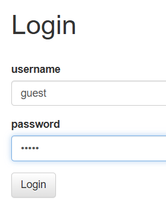
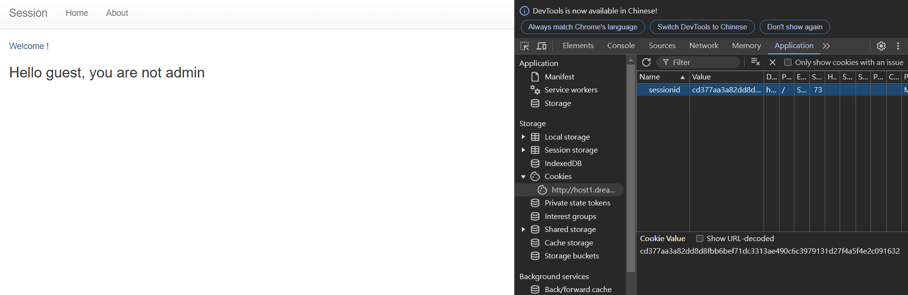
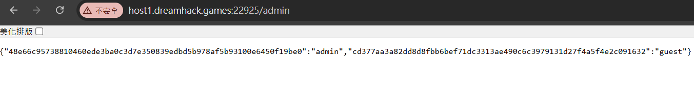
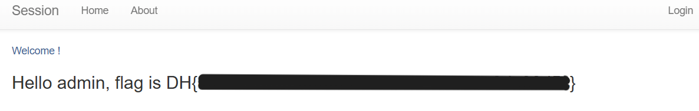

# session-basic

題目

> 쿠키와 세션으로 인증 상태를 관리하는 간단한 로그인 서비스입니다.  
> admin 계정으로 로그인에 성공하면 플래그를 획득할 수 있습니다.  
> 플래그 형식은 DH{...} 입니다.

先用 guest 登入



登入成功



進到 `/admin` 發現 admin 的 sessionid



把 cookies sessionid 改成 admin 的 sessionid

```
48e66c95738810460ede3ba0c3d7e350839edbd5b978af5b93100e6450f19be0
```


