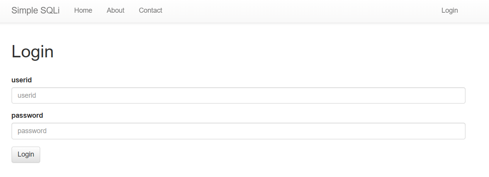
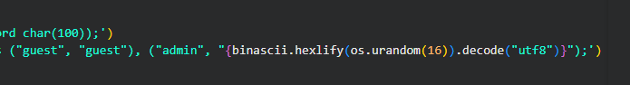
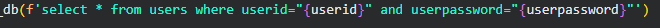
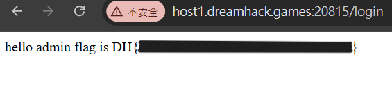

# simple_sqli

題目

> 로그인 서비스입니다.  
> SQL INJECTION 취약점을 통해 플래그를 획득하세요. 플래그는 flag.txt, FLAG 변수에 있습니다.



有兩組帳密



query 的地方是先查 userid ，試試看把後面驗證密碼的地方註解掉



```
userid: admin"--
password: 123
```

得到 flag


