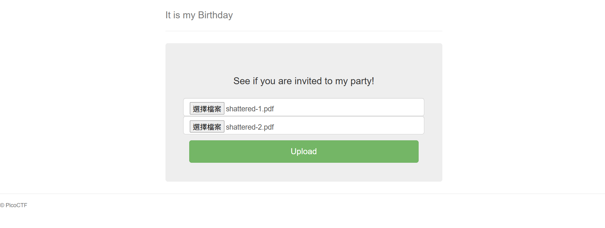
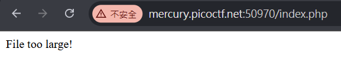
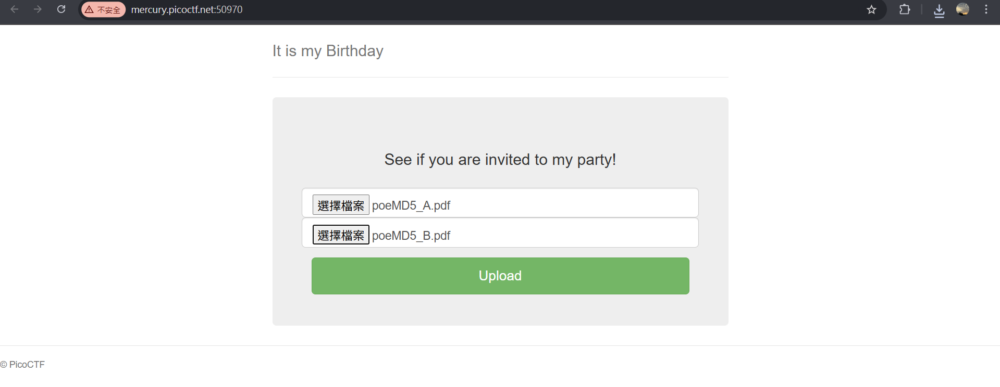
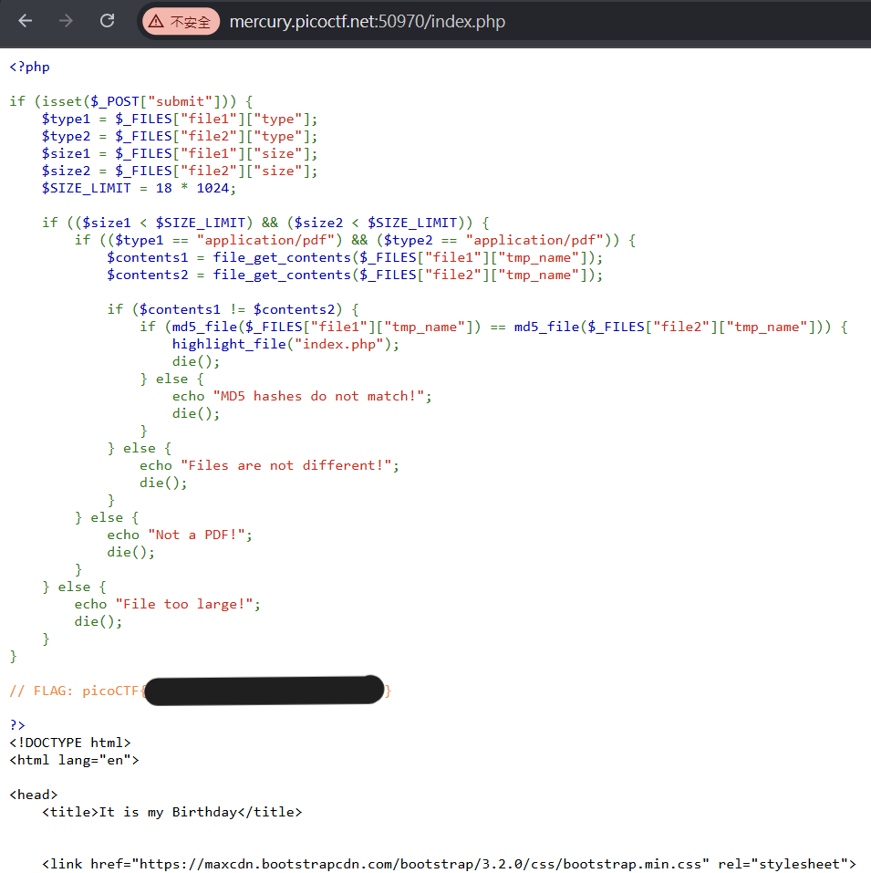

# It is my Birthday

這一題題目說要上傳兩個 pdf 做到 MD5 碰撞

不太知道要怎麼生出兩份內容不同但 MD5 相同的 PDF ，但是在 [SHAttered.io](https://shattered.io/) 可以下載範例的 PDF

結果檔案太大，哭了

拿去線上工具壓縮再試一次，還是檔案太大

又去 [corkami/collisions](https://github.com/corkami/collisions) 下載了兩份 PDF

得到 flag

