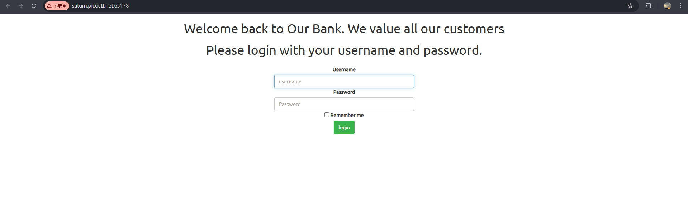
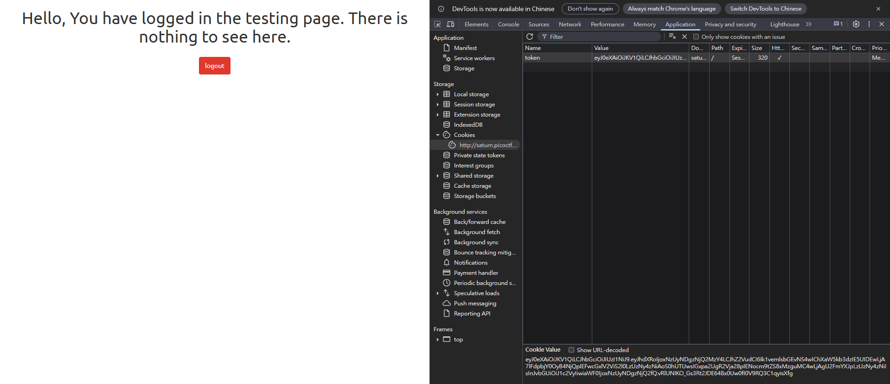
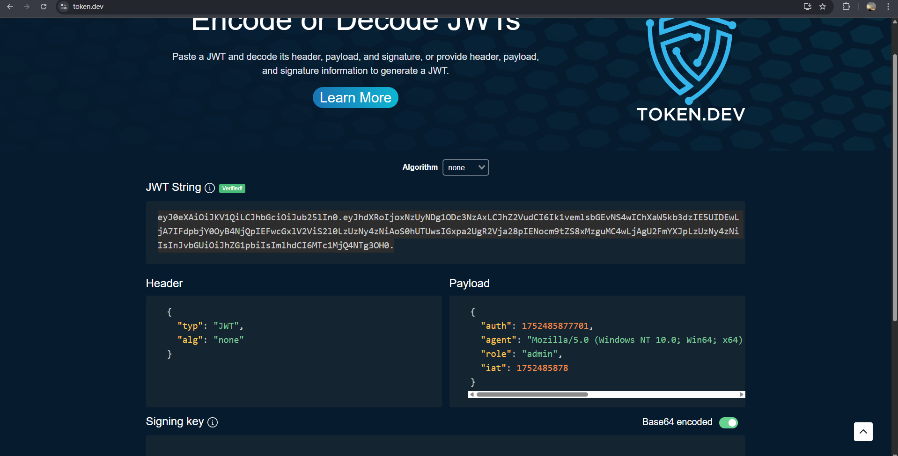
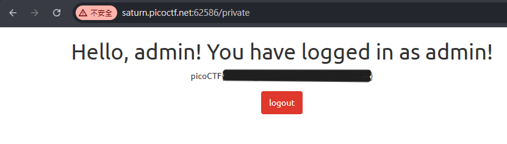

# JAuth

目標是讓身分變成 `admin`

先按照題目用帳號 `test` 密碼 `Test123!` 登入

登入後看到 jwt token，用 hashcat 找 secret key，但是沒有結果

嘗試把 `alg` 的值從 `HS256` 改成 `none`，並把 `role` 從 `user` 改成 `admin` ，並且保留後面的 `.` ，再貼回去

得到 flag

