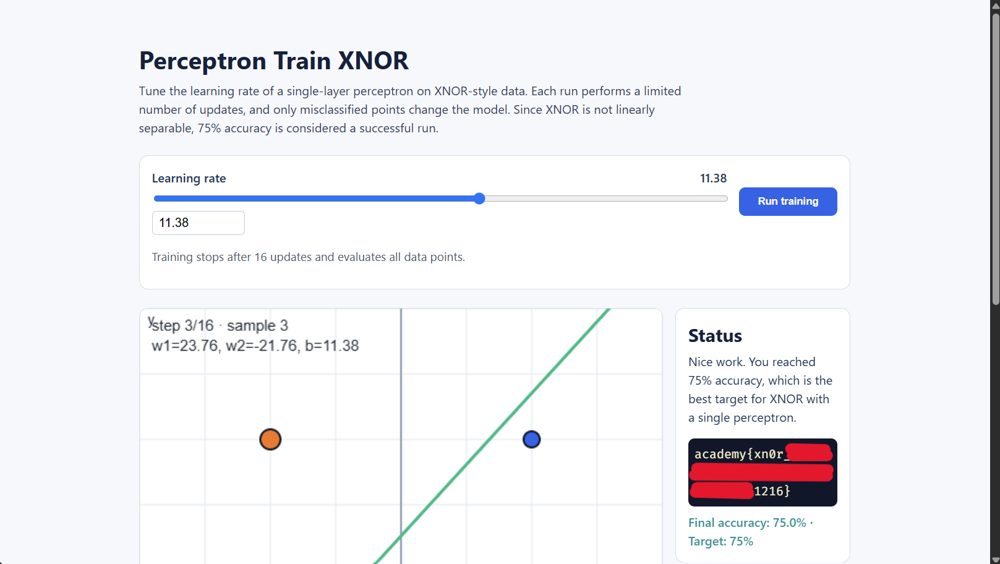
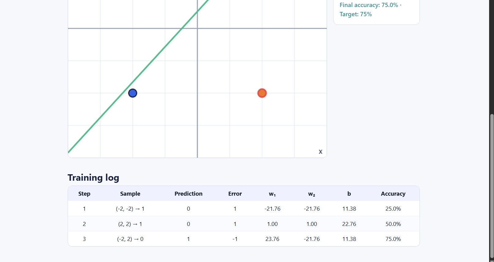

# Perceptron Train XNOR

這題和 Perceptron Train XOR 一樣，要調整 learning rate，讓單層 perceptron 在四個資料點上達到 75% accuracy。每次按下 **Run training** 最多執行 16 個步驟；兩題的差別是標籤相反：這題是 XNOR。

題目給的四個輸入和正確標籤如下：

| Input    | Output |
| -------- | ------ |
| (-2, -2) | 1      |
| (-2, 2)  | 0      |
| (2, -2)  | 0      |
| (2, 2)   | 1      |

相同標籤的點在對角位置。單層 perceptron 用一條直線分類，沒辦法把這兩組對角點完美分開；因此題目將四個點中分對三個，也就是 75%，設為成功條件。

## 第一次更新怎麼算？

Perceptron 先用目前的權重和偏差計算分數：

```text
分數 = w₁x₁ + w₂x₂ + b
```

分數大於或等於 0 時預測為 `1`，小於 0 時預測為 `0`。預測和正確標籤不同，模型才會更新參數。更新時會將錯誤量（正確標籤減預測結果）乘上 learning rate 和輸入值：

```text
新權重 = 舊權重 + learning rate × 錯誤量 × 對應輸入
新偏差 = 舊偏差 + learning rate × 錯誤量
```

這次我使用 learning rate `11.38`。Training log 的第一筆資料是 `(-2, -2) → 1`。從第一次更新後的權重可反推出初始參數是 `w₁=1`、`w₂=1`、`b=0`；因此這個點的分數是：

```text
分數 = 1×(-2) + 1×(-2) + 0 = -4
```

分數小於 0，模型預測為 `0`，和正確標籤 `1` 不同，錯誤量是 `1 - 0 = 1`。代入更新規則後：

```text
w₁ = 1 + 11.38 × 1 × (-2) = -21.76
w₂ = 1 + 11.38 × 1 × (-2) = -21.76
b  = 0 + 11.38 × 1 = 11.38
```

這和 Training log 第 1 步的參數相同。這個例子可以看出，learning rate 乘上錯誤量和輸入，決定權重與偏差這次改變多少；新參數會影響分類線，也會影響後續點的預測。

## 解題過程

將 learning rate 設為 `11.38`，按下 **Run training**。Training log 顯示第 3 步已達到 75% accuracy，右側 Status 也顯示成功並提供 flag。



Training log 記錄了這三筆樣本的預測、錯誤量、參數更新和 accuracy：


