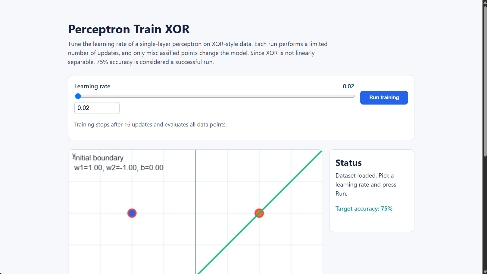
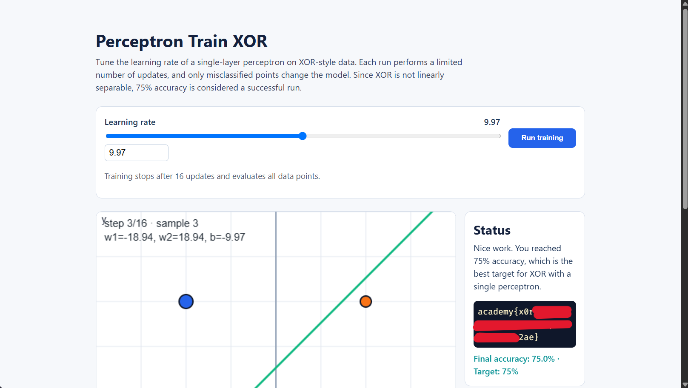
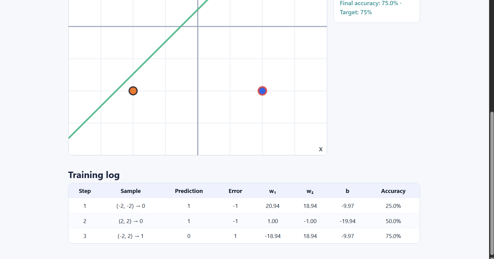

# Perceptron Train XOR

這題的畫面有四個資料點和一條分類線，旁邊可以調整 learning rate。每次按下 **Run training**，畫面最多進行 16 個訓練步驟，並在結束時評估全部資料點；只有分錯時，模型參數才會更新。剛開始我不太確定題目要我找什麼答案；後來才理解，四個點的正確標籤已經包含在資料裡，模型會拿自己的分類結果和標籤比對。我需要做的是調整 learning rate，讓它達到題目設定的準確率。



## 模型怎麼判斷一個點？

每個點有兩個輸入，記作 `x₁` 和 `x₂`。Perceptron 會把它們乘上各自的權重，再加上偏差，算出一個分數：

```text
分數 = w₁x₁ + w₂x₂ + b
```

`w₁`、`w₂` 和 `b` 是模型目前的參數。分數大於或等於 0 時，模型預測為 `1`；小於 0 時，預測為 `0`。分數剛好是 0 的位置就是分類線，因此算出分數，就知道模型把這個點分到哪一類。

接著把預測和資料點原本的標籤比較：兩者相同就是分對，不同就是分錯。訓練時，模型只會調整分錯的點所對應的參數；參數一變，分類線的位置也會變。

## 這題的 XOR 標籤

題目使用的四筆資料如下：

| Input    | Output |
| -------- | ------ |
| (-2, -2) | 0      |
| (-2, 2)  | 1      |
| (2, -2)  | 1      |
| (2, 2)   | 0      |

相同標籤的點位在對角位置。單層 perceptron 只能用一條直線分類，無法把兩個 0 和兩個 1 完美分開。因此題目以 75% 作為成功條件，也就是四個點中答對三個。畫面會自動計算正確率。

## Learning rate 怎麼影響分類？

Learning rate（學習率）控制模型分錯時，權重和偏差要改多少。Perceptron 會用「正確標籤 − 預測結果」算出錯誤量，再依照下面的規則更新參數：

```text
新權重 = 舊權重 + learning rate × 錯誤量 × 對應輸入
新偏差 = 舊偏差 + learning rate × 錯誤量
```

用題目的第一筆資料來算：`(-2, -2)` 的正確標籤是 `0`。初始參數是 `w₁=1`、`w₂=-1`、`b=0`，learning rate 設為 `9.97`。先算分數：

```text
分數 = 1×(-2) + (-1)×(-2) + 0 = 0
```

訓練紀錄顯示這筆資料的預測是 `1`，所以它被分錯，錯誤量為 `0 - 1 = -1`。把錯誤量、輸入和 learning rate 代入更新規則：

```text
w₁ = 1 + 9.97 × (-1) × (-2) = 20.94
w₂ = -1 + 9.97 × (-1) × (-2) = 18.94
b  = 0 + 9.97 × (-1) = -9.97
```

這些數值和畫面 Training log 第 1 步列出的權重、偏差相同。可以看到，learning rate 乘上錯誤量和輸入，決定這次參數改變多少；新參數接著會影響分類線和後續資料點的預測。

## 解題過程

預設 learning rate 是 `0.02`。我把它改成 `9.97`，按下 **Run training** 後，在第 3 次更新達到 75%，右側 Status 也顯示成功和 flag。



Training log 記錄了這三筆樣本的預測、錯誤量、參數更新和 accuracy：


