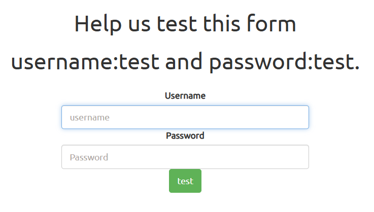
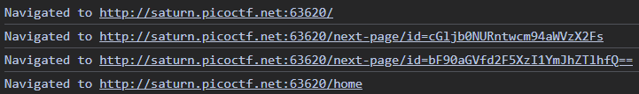
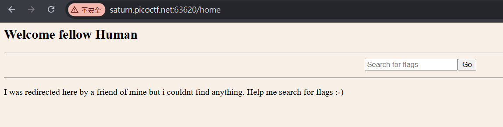
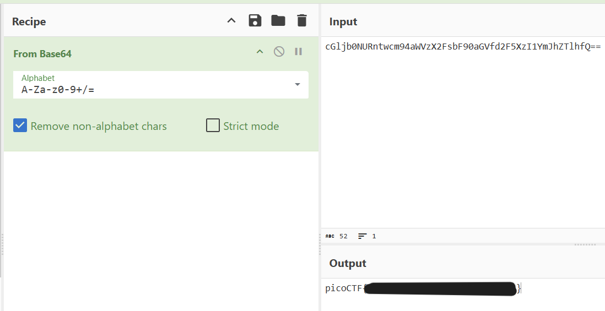

# findme

用帳號 `test` 密碼 `test!`登入

送出後會先有 url `/next-page/id=cGljb0NURntwcm94aWVzX2Fs`

然後是 `/next-page/id=bF90aGVfd2F5XzI1YmJhZTlhfQ==`

最後導到`/home`

前面的 url 看起來就像是 base64

把兩段 id `cGljb0NURntwcm94aWVzX2FsbF90aGVfd2F5XzI1YmJhZTlhfQ==` 拿去 CyberChef

就得到 flag 了
