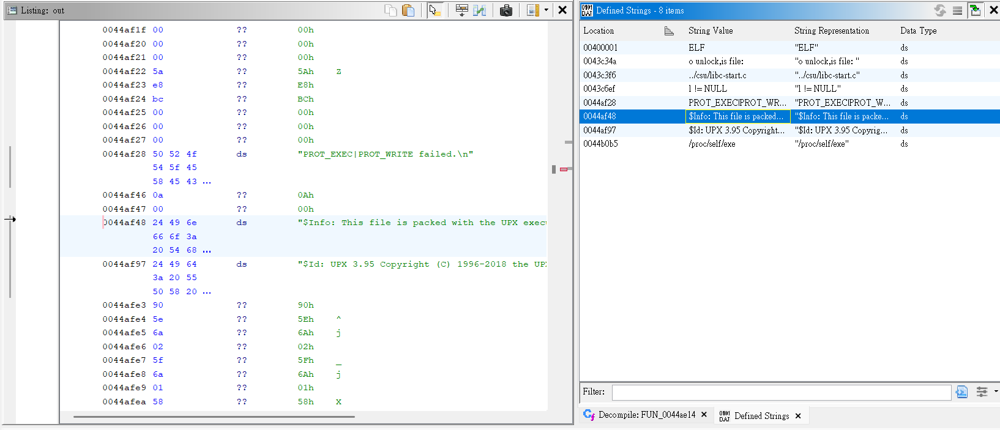
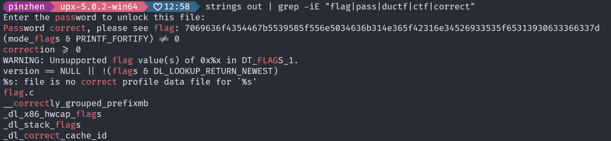
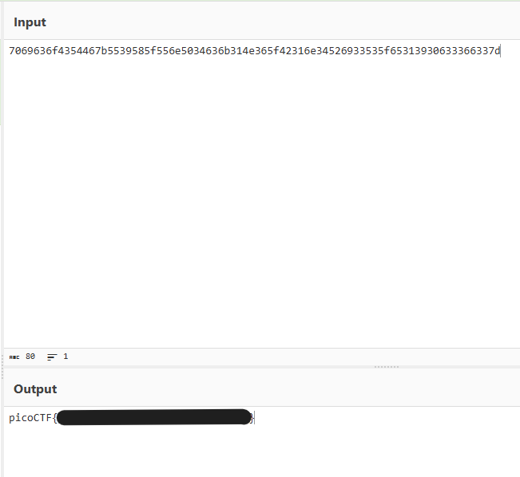

# packer

開 ghidra 之後看到

> Info: This file is packed with the UPX executable packer http://upx.sf.net



先試試看對 `out` 解壓縮

```bash
upx -d out
```

解壓縮後發現要輸入密碼，直接看看有沒有 flag 相關的東西



看到 hex ，拿去 cyberchef 解密



---

好啦，真的要去做正事了，不能再玩了
